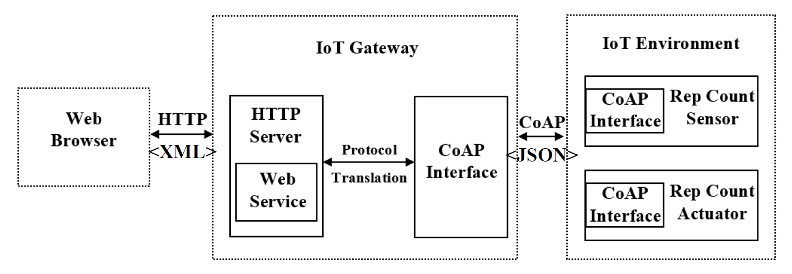
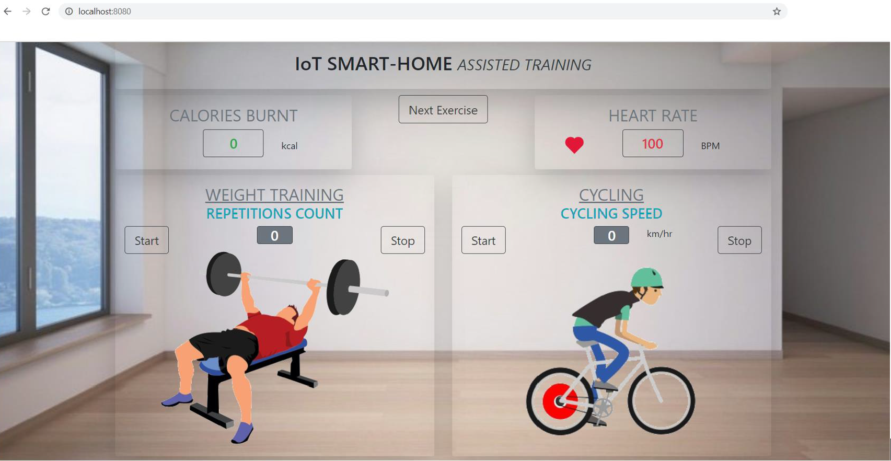

*Project Description*

In this project a Java Web-Application was built to simulate the working of IoT environment in Fitness. It comprises of IoT Gateway, IoT Devices (Sensors and Actuators) and Web platform. IoT Gateway handles the requests and responses from IoT devices using CoAP (Constrained Application Protocol) and from Web application using HTTP protocol, different protocols are utilized for communication between different interfaces with different data encoding schemes (XML and JSON). Technologies used are HTTP and CoAP protocols, JSON and XML encoding schemes, Java Spring-Boot framework, HTML5, CSS, JavaScript and Bootstrap.

This project illustrates the use of smart devices in Assisted Training or for Fitness. Two use-case are implemented in this project, first is Smart-Weight Training and second is Smart-Cycling.

**1. Smart-Weight Training:**
In this use-case, the user performs the weight training exercise (in this case, Bench Press exercise is implemented). The equipment used by user is facilitated with the various smart sensors. These sensors help the user to track his exercise progress and achieve his goal more accurately. As the user performs higher number of repetitions, the calories consumption and heart rate increases exponentially. In total three smart sensors are deployed in this use-case;
  - Rep (Repetition) Count Sensor: Many times user forgets the count of repetitions while performing the exercise. A smart sensor used for acquiring the number of repetitions user performed while executing this exercise.
  - Heart Rate Sensor: Depending on the number of repetitions, the user’s heart rate changes. A smart sensor is used for acquiring the heart rate of the user which changes significantly as the number of repetitions performed by user increases.
  - Calories Count Sensor: Depending on the number repetitions, the user’s calories consumption also changes. A smart sensor is used for acquiring the calories burnt during the exercise of the user which also changes significantly as the number of repetitions performed by user increases.

**2. Smart-Cycling:**
In this use-case, the user performs the cycling or the spinning exercise. The bicycle used by user is facilitated with the various smart sensors. These sensors help the user to track his exercise progress and achieve his goal more accurately. As the user increases the speed of the cycling, the calories consumption and heart rate increases exponentially. In total three smart sensors are deployed in this use-case;
  - Speed Count Sensor: User is incapable to count the speed of the bicycle by his own, hence a smart sensor is used for acquiring the speed with which the user is cycling.
  - Heart Rate Sensor: Depending on the speed of the cycle, the user’s heart rate changes. A smart sensor is used for acquiring the heart rate of the user which changes significantly as the speed of the cycling increases.
  - Calories Count Sensor: Calories count is the most important aspect in the fitness. Depending on the speed of the cycle, the user’s calories consumption also changes. A smart sensor is used for acquiring the calories burnt during the exercise of the user which also changes significantly as the speed of the cycling increases.
